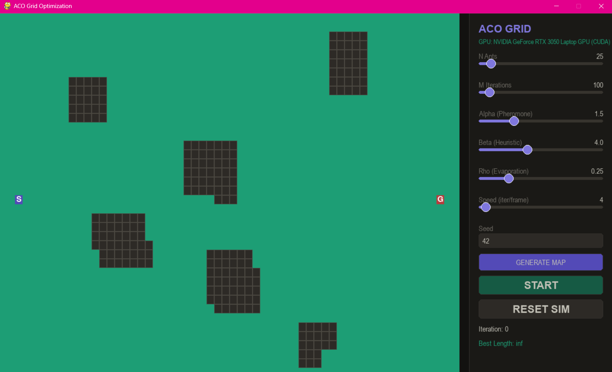
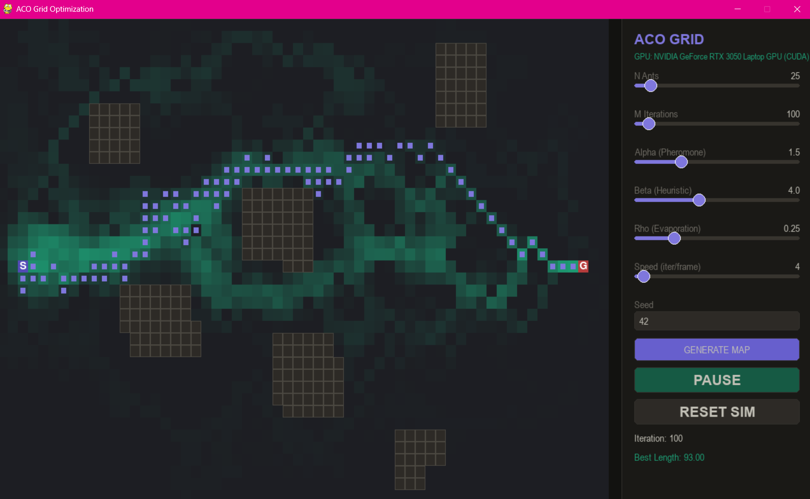
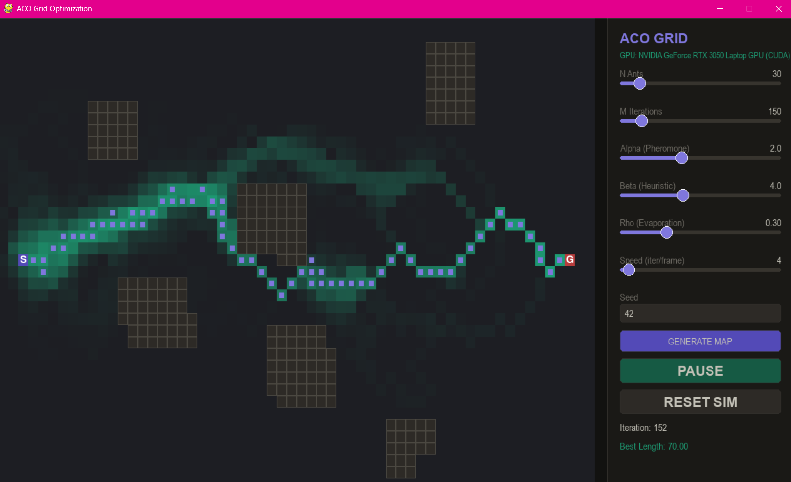

# Proyecto final

### Optimización de rutas con Ant Colony Optimization usando PyTorch

Karol Guerrero, Kevin García y Juan Jose Marquez  
Universidad Sergio Arboleda, mayo 2026

---

# 1. Objetivo del laboratorio

Este proyecto tiene como objetivo implementar el algoritmo Ant Colony Optimization (ACO) para encontrar rutas eficientes dentro de un entorno con obstáculos. La simulación fue desarrollada en Python utilizando PyTorch para el manejo de tensores y aceleración mediante GPU cuando está disponible.

Además de implementar el algoritmo, también se buscó visualizar el comportamiento colectivo de las hormigas y analizar cómo las feromonas permiten que el sistema converja progresivamente hacia rutas más eficientes.

---

# 2. Marco teórico

Ant Colony Optimization (ACO) es un algoritmo basado en el comportamiento de las hormigas reales. Cuando las hormigas buscan alimento, dejan rastros de feromonas sobre el camino recorrido. Otras hormigas detectan esas feromonas y tienden a seguir las rutas con mayor concentración.

Con el tiempo, los caminos más cortos reciben más tránsito y acumulan mayores cantidades de feromonas, mientras que los caminos menos eficientes desaparecen debido a la evaporación.

En este proyecto, el entorno fue representado mediante una grilla bidimensional con obstáculos rectangulares. Las hormigas virtuales recorren el mapa seleccionando movimientos según probabilidades calculadas a partir de dos factores:

- La cantidad de feromonas presentes.
- La distancia al objetivo.

La probabilidad utilizada por el algoritmo está dada por la siguiente expresión P(i,j) = τ^α · η^β 

Donde:

- τ representa la cantidad de feromonas.
- η representa la heurística basada en distancia.
- α controla la importancia de las feromonas.
- β controla la importancia de la heurística.

También se implementó evaporación de feromonas utilizando el parámetro rho, permitiendo que el sistema continúe explorando nuevas soluciones y evitando que el algoritmo quede atrapado en rutas poco eficientes.

---

  <h1>3. Metodología</h1>

<b>a. Configuración del Hardware</b>

Para el desarrollo del proyecto se utilizó un computador con Python instalado y soporte para ejecución mediante CPU. El sistema también fue diseñado para detectar automáticamente GPU NVIDIA mediante CUDA o dispositivos Apple Silicon mediante MPS cuando estuvieran disponibles.

La detección del dispositivo se realizó automáticamente utilizando PyTorch.

 

<b>b. Configuración del Software</b>

El proyecto fue desarrollado en Python utilizando las siguientes librerías:

- PyTorch, para manejo de tensores y aceleración.
- Pygame, para visualización gráfica.
- NumPy, para operaciones matemáticas.
- Threading y ThreadPoolExecutor, para paralelismo.

La simulación fue organizada modularmente mediante varios archivos encargados de funciones específicas como generación del mapa, renderizado y ejecución del algoritmo.

 

<b>c. Explicación del algoritmo desarrollado</b>

El sistema genera inicialmente un mapa bidimensional compuesto por celdas libres y obstáculos rectangulares. Además, se define un punto de inicio y una meta.

  

Antes de iniciar la simulación, el programa verifica mediante BFS que exista al menos un camino válido entre el inicio y la meta. Si el mapa generado no tiene solución, se crea uno nuevo automáticamente.

Posteriormente se inicializan dos matrices principales:

- Tau: almacena las feromonas.
- Eta: almacena la heurística basada en distancia.

Cada hormiga comienza desde el punto inicial y recorre el mapa seleccionando vecinos válidos según probabilidades calculadas con feromonas y heurística. Las hormigas depositan feromonas sobre los caminos recorridos y las rutas más cortas reciben una mayor cantidad de feromonas, mientras que en cada iteración ocurre evaporación para evitar acumulación permanente. Con suficientes iteraciones, el sistema converge progresivamente hacia rutas más eficientes.

  

 

  <h1>4. Resultados</h1>

Durante la ejecución del proyecto se observó que el algoritmo logra encontrar rutas válidas evitando correctamente los obstáculos del mapa. En las primeras iteraciones las hormigas exploran múltiples caminos aleatorios. Sin embargo, a medida que aumenta la cantidad de iteraciones las feromonas comienzan a concentrarse sobre rutas más eficientes. La interfaz gráfica permite visualizar:

- El mapa generado.
- La concentración de feromonas.
- Las hormigas en movimiento.
- El mejor camino encontrado.

También se observó que parámetros como alpha, beta y rho afectan significativamente el comportamiento del algoritmo.

- Valores altos de alpha hacen que las hormigas sigan caminos ya conocidos.
- Valores altos de beta priorizan rutas cercanas al objetivo.
- Valores altos de rho provocan una evaporación más rápida de las feromonas.

Durante las pruebas se encontró que el sistema converge correctamente hacia soluciones eficientes después de varias iteraciones.

  

# 5. Análisis del rendimiento

El proyecto implementa paralelismo utilizando ThreadPoolExecutor para ejecutar múltiples hormigas simultáneamente. Esto permite mejorar el rendimiento del sistema y evitar que la interfaz gráfica se congele durante la simulación. Además, pyTorch permite aprovechar aceleración mediante GPU cuando está disponible especialmente para operaciones relacionadas con matrices de feromonas y heurísticas.

Se observó que aumentar la cantidad de hormigas mejora la exploración del entorno, aunque también incrementa el costo computacional. De igual manera, el número de iteraciones influye directamente en la convergencia del algoritmo, ya que una mayor cantidad de iteraciones permite reforzar progresivamente las mejores rutas.

---

# Conclusiones

En este proyecto se logró implementar correctamente el algoritmo Ant Colony Optimization sobre un entorno con obstáculos, permitiendo visualizar cómo múltiples hormigas colaboran indirectamente mediante feromonas para encontrar rutas eficientes,también fue posible comprender cómo parámetros como alpha, beta y rho afectan el comportamiento del algoritmo y el proceso de convergencia y por otro lado el uso de PyTorch y paralelismo permitió mejorar el rendimiento general de la simulación y demostrar cómo este tipo de algoritmos puede beneficiarse del procesamiento paralelo.

